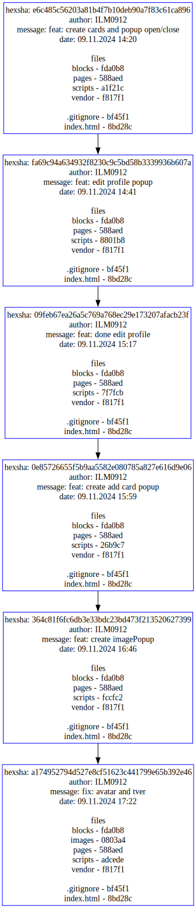
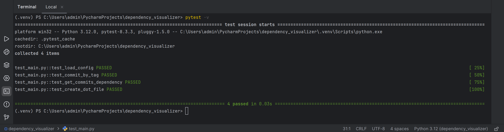

# Описание
Инструмент командной строки для визуализации графа зависимостей для коммитов, в узлах которого находятся 
списки файлов и папок. Граф строится для тега с заданным именем. 

# Установка

1. Установка программы и переход в директорию
   ```bash
   git clone <URL репозитория>
   cd <директория проекта>
   ```
   
2. Установка graphviz
   ```bash
   brew install graphviz # для macOs
   sudo apt install graphviz # для Linux (Ubuntu/Debian)
   ```
   **Для Windows**: загрузите с официального сайт Graphviz (https://graphviz.org/download/) и скачайте установочный файл Graphviz для Windows. Добавьте Graphviz в переменные среды.

3. Убедитесь, что у вас установлен Python

4. Создайте и активируйте виртуальное окружение:
   ```bash
   python3 -m venv venv
   source venv/bin/activate  # Для Linux/Mac
   venv\Scripts\activate     # Для Windows
   ```
5. Установите необходимые зависимости:
   ```bash
   pip install pytest
   ```

# Конфигурационный файл

Для запуска визуализатора необходимо подготовить конфигурационный файл формата csv.
Файл config.csv должен содержать данные в следующем формате:
```bash
graphviz_path,"Путь к программе для визуализации графов"
repository_path,"Путь к анализируемому репозиторию." 
tag_name,"Имя тега в репозитории."
```
Если коммита с указанным тегом не существует, граф будет построен от последнего коммита (HEAD)

# Запуск визуализатора

С готовым конфигурационным файлом config.csv выполнить следующую команду
   ```bash
   python main.py
   ```

# Выходные данные

Программа создает три файла в директории проекта:

- **commit_graph.dot** -- Текстовая версия графа
- **commit_graph.png** -- Граф в формате png (растровое изображение)
- **commit_graph.svg** -- Граф в формате svg (векторное изображение)

### Примеры выходных данных:

commit_graph.svg

# Тесты
   Перед запуском убедиться, что библотека pytest установлена, если нет, то установить:
   ```bash
   pip install pytest
   ```
   Затем запустить тесты:
   ```bash
   pytest -v
   ```
   
   ### Результаты тестирования
   